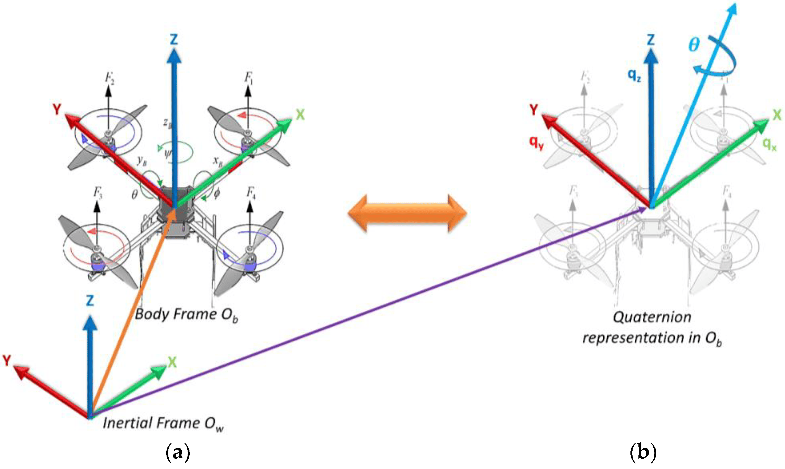

# Quaternions

## Quaternions in Aerial Robotics: A Technical Overview

### 1. Introduction to Quaternions

Quaternions are four-dimensional complex numbers that provide a convenient mathematical notation for representing spatial rotations and orientations. They were first described by William Rowan Hamilton in 1843 and have become essential in modern aerial robotics, particularly in drone navigation and control systems.

A quaternion q is represented as:

```
q = w + xi + yj + zk
```

where:

* w is the scalar (real) component
* x, y, z are the vector (imaginary) components
* i, j, k are the fundamental quaternion units

<figure><figcaption></figcaption></figure>

### 2. Advantages of Quaternions in Aerial Robotics

#### 2.1 Comparison with Euler Angles

* No gimbal lock issues
* More computationally efficient
* Smoother interpolation between orientations
* Better numerical stability
* Compact representation (4 numbers vs. 9 for rotation matrices)

#### 2.2 Key Benefits for Drones

* More stable attitude estimation
* Reduced computational overhead
* Smoother transitions during autonomous maneuvers
* Better handling of rapid rotations
* Improved precision in orientation tracking

### 3. Implementation in Popular Flight Control Systems

#### 3.1 ArduPilot Implementation

ArduPilot uses quaternions extensively in its attitude estimation and control systems:

**Core Components:**

1. **AP\_AHRS (Attitude Heading Reference System)**
   * Maintains vehicle orientation using quaternions
   * Implements quaternion-based sensor fusion
   * Found in libraries/AP\_AHRS/AP\_AHRS.h

**Key Functions:**

```cpp
// Example from ArduPilot
class AP_AHRS {
public:
    // Get quaternion representing current attitude
    const Quaternion& get_quaternion() const;
    
    // Convert euler angles to quaternions
    void to_quaternion(Quaternion& quat) const;
    
    // Update attitude using quaternion-based EKF
    void update_quaternion(const Vector3f& gyro, float dt);
};
```

#### 3.2 PX4 Implementation

PX4 utilizes quaternions throughout its flight stack:

**Core Components:**

1. **attitude\_estimator\_q**
   * Quaternion-based attitude estimation
   * Implements complementary filter
   * Located in src/modules/attitude\_estimator\_q
2. **mc\_att\_control**
   * Quaternion-based attitude control for multicopters
   * Handles attitude setpoint tracking
   * Found in src/modules/mc\_att\_control

**Key Functions:**

```cpp
// Example from PX4
namespace matrix {
class Quaternion {
public:
    // Constructor from euler angles
    Quaternion(const Euler& euler);
    
    // Rotate a vector
    Vector3f rotate(const Vector3f& vec) const;
    
    // Convert to rotation matrix
    Matrix3f to_dcm() const;
};
}
```

### 4. Practical Applications

#### 4.1 Attitude Estimation

* Sensor fusion using Extended Kalman Filter (EKF)
* Integration of gyroscope, accelerometer, and magnetometer data
* Quaternion-based complementary filters

#### 4.2 Control Systems

* Quaternion feedback for attitude control
* Trajectory planning and tracking
* Smooth transition between waypoints

#### 4.3 Mission Planning

* Waypoint navigation using quaternion interpolation
* Obstacle avoidance with quaternion-based orientation changes
* Smooth trajectory generation

### 5. Mathematical Operations

#### 5.1 Basic Operations

```
// Quaternion multiplication
q1 ⊗ q2 = [w1w2 - x1x2 - y1y2 - z1z2] +
          [w1x2 + x1w2 + y1z2 - z1y2]i +
          [w1y2 - x1z2 + y1w2 + z1x2]j +
          [w1z2 + x1y2 - y1x2 + z1w2]k

// Quaternion conjugate
q* = w - xi - yj - zk

// Quaternion norm
||q|| = √(w² + x² + y² + z²)
```

#### 5.2 Rotation Operations

```
// Rotating a vector v by quaternion q
v' = q ⊗ v ⊗ q*

// Converting euler angles to quaternion
w = cos(roll/2)cos(pitch/2)cos(yaw/2) + sin(roll/2)sin(pitch/2)sin(yaw/2)
x = sin(roll/2)cos(pitch/2)cos(yaw/2) - cos(roll/2)sin(pitch/2)sin(yaw/2)
y = cos(roll/2)sin(pitch/2)cos(yaw/2) + sin(roll/2)cos(pitch/2)sin(yaw/2)
z = cos(roll/2)cos(pitch/2)sin(yaw/2) - sin(roll/2)sin(pitch/2)cos(yaw/2)
```

### 6. Best Practices

#### 6.1 Implementation Guidelines

* Always normalize quaternions after operations
* Use double precision for quaternion calculations
* Implement proper error checking for singularities
* Regularly validate quaternion integrity

#### 6.2 Common Pitfalls

* Forgetting to normalize after operations
* Incorrect order of quaternion multiplication
* Mishandling of singularity cases
* Improper conversion between different rotation representations

### 7. Performance Considerations

#### 7.1 Computational Efficiency

* Quaternion operations require fewer floating-point operations than matrices
* Memory footprint is smaller compared to rotation matrices
* Better cache utilization due to compact representation

#### 7.2 Optimization Techniques

* Use SIMD instructions for quaternion operations
* Implement lookup tables for common operations
* Optimize quaternion multiplication using specialized algorithms

### 8. Testing and Validation

#### 8.1 Unit Testing

* Verify basic quaternion operations
* Test conversion accuracy
* Validate rotation sequences
* Check edge cases and singularities

#### 8.2 Integration Testing

* Verify attitude estimation accuracy
* Test control system stability
* Validate trajectory tracking performance
* Measure computational overhead
