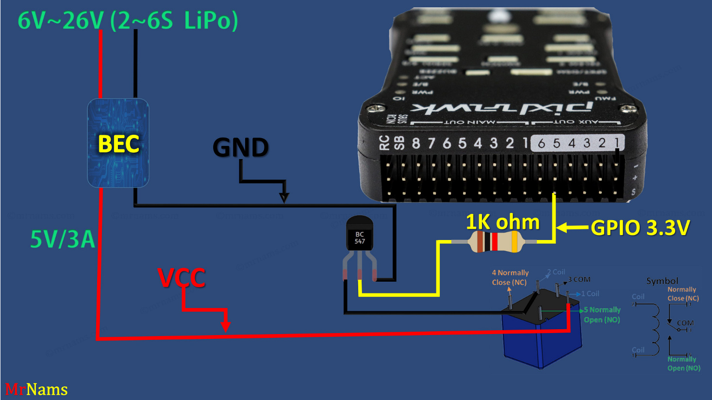

# Relay Switch

Warning

[This function is a GPIO and has limited current capabilities.](https://ardupilot.org/plane/docs/common-gpios.html#gpio-warning)

A “Relay” is a digital output pin on the autopilot that can be switched between 0 volts and either 3.3V or 5V, depending on the autopilot. Similar to a servo it allows the autopilot to invoke some action from another device on the vehicle. Up to 6 relays can be implemented.

The digital outputs that can be used as a relay are GPIOs. Normal servo/motor outputs can be configured for GPIO use. Occasionally, an autopilot will dedicate some pins for purely GPIO use as internal power controls, general purpose use,.etc. Consult the autopilot’s documentation for pin number and information. In addition, it is possible to create a DroneCAN peripheral that has dedicated pins for relay use and these can be controlled as remote relays.

### Relay Parameter Setup

Setup of a relay requires that which pin it controls be set, and its default state. In addition, some autopilot functions can be assigned to the relay.

Examples below for the second Relay:

* [RELAY2\_FUNCTION](https://ardupilot.org/plane/docs/parameters.html#relay2-function): the control of the relay pin can be assigned as a normal relay, controlled by GCS or RC switch, or as the output of other features like parachute release, camera, brushed motor reversing relay, etc.. See table below for values. A non-zero value will show the remaining parameters after a parameter refresh.

| RELAYx\_FUNCTION | FUNCTION                                                                      |
| ---------------- | ----------------------------------------------------------------------------- |
| 0                | None                                                                          |
| 1                | Relay                                                                         |
| 2                | ICE Ignition (Plane Only)                                                     |
| 3                | Parachute(Plane/Copter Only)                                                  |
| 4                | Camera                                                                        |
| 5                | Bushed motor reverse 1 throttle or throttle-left or omni motor 1 (Rover Only) |
| 6                | Bushed motor reverse 2 throttle-right or omni motor 2 (Rover Only)            |
| 7                | Bushed motor reverse 3 omni motor 3 (Rover Only)                              |
| 8                | Bushed motor reverse 4 omni motor 4 (Rover Only)                              |
| 9                | ICE Starter (Plane Only)                                                      |

* [RELAY2\_PIN](https://ardupilot.org/plane/docs/parameters.html#relay2-pin): the autopilot designated GPIO pin to be used for the function. See the [GPIOs](https://ardupilot.org/plane/docs/common-gpios.html#common-gpios) page for information on how to determine the pin numbers and setup for using autopilot servo/motor outputs. DroneCAN peripherals with remote relay outputs have pin numbers in the 1000 to 1015 range. Consult the peripheral’s documentation for proper pin number to use.
* [RELAY2\_DEFAULT](https://ardupilot.org/plane/docs/parameters.html#relay2-default): After boot up, should the relay default to ON (1) or OFF (0, default), or 2 = no change from bootloader state for the relay output pin. This only applies to RELAYx\_FUNC “Relay” (1). All other uses will pick the appropriate default output state from within the controlling function’s parameters.
* [RELAY2\_INVERTED](https://ardupilot.org/plane/docs/parameters.html#relay2-inverted): this parameter controls the actual output voltage level corresponding to the “ON” state. If set to “1”, the ON will actually be a low output, versus the normal high output voltage level. Will also impact the [RELAY2\_DEFAULT](https://ardupilot.org/plane/docs/parameters.html#relay2-default) output voltage level.

Note

any change to relay pin setup requires a reboot to take effect.

Parameter setup is shown below using Mission Planner:

<figure><figcaption></figcaption></figure>

the RELAYx\_PIN dropdown box shows some of the common pin numbers, but any appropriate number can be manually entered.

### Pilot control of the relay

The relays can be controlled with the auxiliary switches. These can be set using the CONFIG/User Params screen as shown below:

Note

This screen allows setting RC5 thru RC14, but any RC channel (1-16) can have its `RCx_OPTION` (See [Auxiliary Functions](https://ardupilot.org/plane/docs/common-auxiliary-functions.html#common-auxiliary-functions)) set as a RELAY, if its not already being used as another control function using the CONFIG/Full Parameter List screen.

### Mission control of the relay

Similar to a servo, the Relays can be activated during a mission using the Do-Set-Relay mission command. This is described on the [Copter Mission Command List wiki page](https://ardupilot.org/copter/docs/mission-command-list.html#mission-command-list-do-set-relay).

Note

In MAVLink the relays are numbered 0-5 instead of 1-6, so RELAY 0 is the first relay

### Mission Planner control of the relay

Mission Planner allows the user to use buttons to set any relay outputs to low, high or set it low and briefly toggle it high using the DATA screen and the Servo/Relay sub-window, as shown below:

#### Connection Diagram

<figure><figcaption></figcaption></figure>
